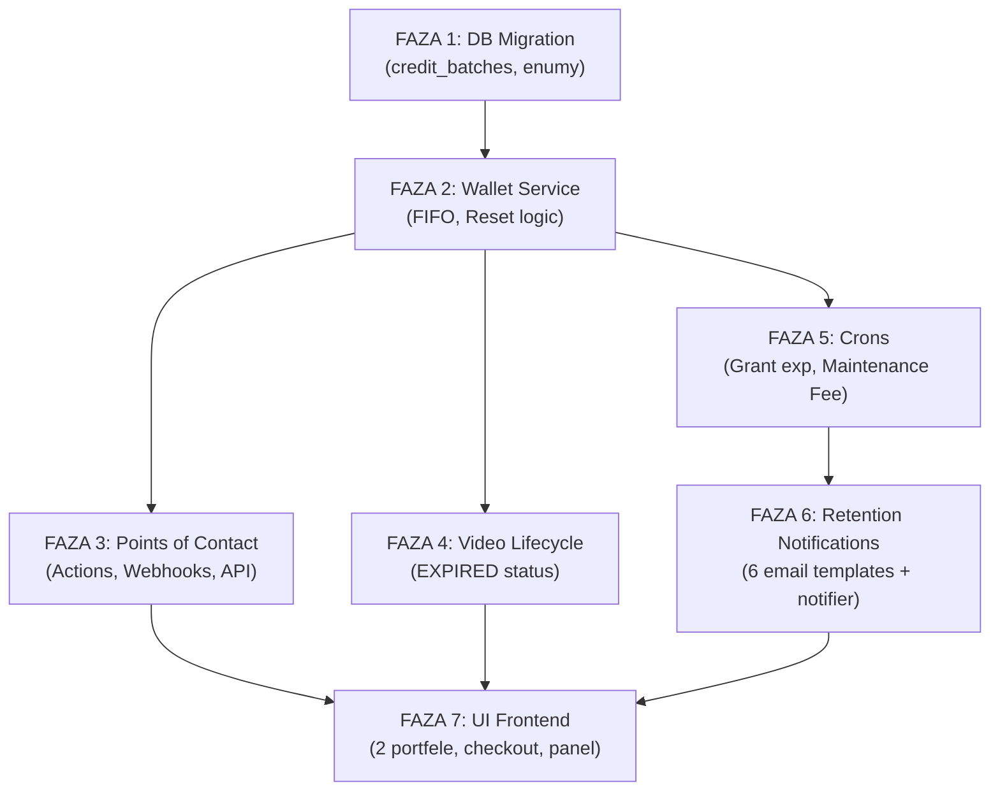

# Specyfikacja Techniczna: System Portfela SPV (Ledger) i Cykl Życia Wideo

**Wersja:** 3.0
**Status:** Ready for Dev
**Kontekst:** Architektura Dwóch Portfeli (Promo / Purchased) z mechanizmami retencyjnymi i breakage

---

## 1. Architektura Danych: Model "Credit Ledger" z Dwoma Portfelami

System natywnie obsługuje **dwa oddzielne salda** dla każdego użytkownika. Środki pobierane są zawsze w ścisłej kolejności: **najpierw portfel promocyjny, potem główny**.

| Portfel | Typ Środków | Ważność | Cel Biznesowy |
| :--- | :--- | :--- | :--- |
| **Portfel Promocyjny** (Grant Credits) | Darmowe na start / bonusy | **60 dni** (sztywno, nieodnawialne) | Onboarding, zbudowanie nawyku. Wygaśnięcie ma wymusić pierwszą wpłatę (min. 15 PLN). |
| **Portfel Główny** (Purchased Credits) | Kupione za gotówkę + bonusy do pakietów | **12 mc** od ostatniej aktywności | Tutaj realizuje się zysk z **breakage** (środki opłacone, ale niewykorzystane). |

### 1.1. Tabela: `credit_batches` (Partie Środków - Wloty)
Tabela przechowuje każdy "zastrzyk" punktów. Jeden zakup w Stripe = Jeden rekord w tej tabeli.

| Kolumna | Typ Danych | Opis / Logika Biznesowa |
| :--- | :--- | :--- |
| `id` | UUID | Primary Key |
| `user_id` | UUID | Foreign Key -> Users |
| `wallet` | ENUM | **`PROMO`** (Portfel Promocyjny) lub **`MAIN`** (Portfel Główny). Kluczowe pole dla dwu-portfelowej architektury. |
| `type` | ENUM | `PROMO_GRANT` (Startowe), `PURCHASED` (Kupione), `BONUS` (Gratis do pakietu), `EARNED_TIP` (Napiwki od innych) |
| `initial_amount` | INTEGER | Wartość początkowa partii (np. 1000). Stała. |
| `current_balance` | INTEGER | **Aktualnie dostępne środki** w tej partii. Zmniejsza się przy wydawaniu (UPDATE). |
| `created_at` | TIMESTAMP | Data nabycia/przyznania. Kluczowa dla podatków (Moment SPV). |
| `expires_at` | TIMESTAMP | Data ważności tej konkretnej partii. |
| `last_activity_at` | TIMESTAMP | Data ostatniej transakcji dotyczącej tej partii. Używana do kalkulacji 12-mc okna nieaktywności w Portfelu Głównym. |
| `is_frozen` | BOOLEAN | (Opcjonalnie) `true` jeśli trwa procedura chargeback w Stripe. Blokuje użycie. |

### 1.2. Tabela: `credit_transactions` (Dziennik Operacji - Wyloty)
Tabela "tylko do odczytu" (append-only), rejestrująca każde użycie punktów.

| Kolumna | Typ Danych | Opis / Logika Biznesowa |
| :--- | :--- | :--- |
| `id` | UUID | Primary Key |
| `user_id` | UUID | Użytkownik wykonujący akcję. |
| `batch_id` | UUID | Foreign Key -> `credit_batches`. Wiąże wydanie z konkretną partią zakupu (Śladowość). |
| `related_video_id`| UUID | (Nullable) Foreign Key -> `shorts`. Czego dotyczyła usługa? |
| `amount` | INTEGER | Wartość ujemna (np. -50) dla wydatków, dodatnia dla korekt/zwrotów. |
| `action_type` | ENUM | `BOOST_STD`, `BOOST_GEO`, `EXTENSION`, `SUPER_LIKE`, `MAINTENANCE_FEE`, `WATERMARK_RM`. |
| `created_at` | TIMESTAMP | Data operacji. |

### 1.3. Tabela: `shorts` (Modyfikacja o Cykl Życia)
Dodajemy logikę czasową do wideo.

| Kolumna | Typ Danych | Opis |
| :--- | :--- | :--- |
| `status` | ENUM | `PUBLISHED` (Publiczne), `EXPIRED` (Ukryte/Prywatne), `ARCHIVED` (Usunięte z R2). |
| `published_at` | TIMESTAMP | Data startu. |
| `expiration_date` | TIMESTAMP | Data końca emisji. Domyślnie +30 dni od `published_at` (chyba że przedłużono). |

---

## 2. Core Logic: Silnik Portfela (Wallet Engine)

Logika ta musi być zaimplementowana po stronie Backend (API), a nie Frontend, aby zapobiec manipulacjom.

### 2.1. Algorytm Wydawania (Spending Strategy - Wallet-First FIFO)
Endpoint `POST /api/wallet/spend` (np. koszt 800 pkt) wykonuje:

1.  **Fetch:** Pobierz wszystkie rekordy z `credit_batches` dla usera, gdzie `current_balance > 0`, `expires_at > NOW()` i `is_frozen = false`.
2.  **Sort:** Posortuj wyniki według priorytetu **dwóch portfeli**:
    * **Krok A – Portfel Promocyjny (wallet = PROMO):** Zawsze pierwszy.
      * 1. `type = PROMO_GRANT` (Najpierw darmowe - user musi je zużyć, bo znikną).
      * 2. `expires_at ASC` (Najbliższa data wygaśnięcia).
    * **Krok B – Portfel Główny (wallet = MAIN):** Dopiero gdy PROMO wyczerpany.
      * 1. `type = EARNED_TIP` (Środki zarobione).
      * 2. `expires_at ASC` (Najstarsze kupione środki - zasada FIFO).
3.  **Deduct (Pętla):**
    * Pobieraj z pierwszej partii. Jeśli brakuje, zeruj ją i dobieraj z kolejnej.
    * Dla każdego odjęcia wykonaj:
        * `UPDATE credit_batches SET current_balance = X ...`
        * `UPDATE credit_batches SET last_activity_at = NOW() ...` (dla partii z MAIN – przedłuża okno aktywności).
        * `INSERT INTO credit_transactions ...` (Zapisz relację `batch_id`).

### 2.2. Zarządzanie Wygasaniem (Expiration Rules)

#### Reguła 1: Portfel Promocyjny (Grant Credits – House Money)
* Ważność: **60 dni** od utworzenia konta. **Sztywna, nieodnawialna.**
* *Akcja Cron:* Zerowanie `current_balance` wszystkich partii `wallet = PROMO` po terminie.
* *Cel:* Wygaśnięcie wywołuje u użytkownika strach przed utratą wypracowanych statystyk (zasięgi z darmowych boostów) i wymusza pierwszą wpłatę (min. 15 PLN).

#### Reguła 2: Portfel Główny – Wygasanie i Smart Breakage (Purchased Credits)
* Ważność bazowa: **12 miesięcy** od ostatniej aktywności (`last_activity_at`).
* **⚠️ ZAKAZ:** Absolutny zakaz pobierania opłat za bezczynność w walucie fiducjarnej (PLN). Łamie obietnicę kontroli kosztów i rodzi ryzyko regulacyjne (KNF).

**Mechanizm Maintenance Fee (Smart Breakage):**
Po upływie 12 miesięcy braku aktywności system **nie zeruje** konta od razu. Zamiast tego:
1. Cron rozpoczyna pobieranie cyklicznej **opłaty utrzymaniowej: 500 pkt/miesiąc** z Portfela Głównego.
2. Opłata jest wyrażona wyłącznie w punktach wirtualnych (nie PLN).
3. Trwa aż do:
   * Wyzerowania salda Portfela Głównego, **LUB**
   * Reakcji usera (transakcja/zakup – patrz Reset poniżej).
4. Każde pobranie opłaty generuje `INSERT INTO credit_transactions` z `action_type = MAINTENANCE_FEE`.
* *Cel biznesowy:* Generuje czysty zysk operacyjny (breakage) w sposób bezpieczny prawnie.

#### Reguła 3: Strategia Resetu Ważności (Incentivized Reset)
System różnicuje wartość resetu w zależności od rodzaju aktywności, aby uniknąć "gry" pojedynczymi groszami:

| Typ Aktywności | Reset `expires_at` | Dodatkowe Efekty | Warunek |
| :--- | :--- | :--- | :--- |
| **Spending** (wydanie punktów w apce) | **+6 miesięcy** od NOW | Ratuje punkty, ale szybciej wymusza ponowne zaangażowanie | Tylko jeśli nowy termin > obecny `expires_at` |
| **Top-up** (zakup pakietu, min. 15 PLN) | **+12 miesięcy** od NOW | **Premium Reset** – pełny cykl + utrzymanie/nadanie Statusu Premium | Reset wszystkich partii `wallet = MAIN` |

*Częściowy Reset Transakcyjny (Spending):* Użytkownik, który wydaje punkty, przedłuża ważność konta, ale tylko o 6 mc. To ocalenie, nie pełna odnowa.

*Premium Reset (Top-up):* Tylko wniesienie nowego kapitału (min. 15 PLN) daje pełne 12 mc i utrzymuje ewentualny Status Premium.

### 2.3. Wyzwalacze Psychologiczne – System Powiadomień (Push / E-mail)

System powiadomień jest zintegrowany z cyklem życia kredytów i opiera się na dwóch mechanizmach behawioralnych:

#### A) Błąd Utopionych Kosztów (Sunk Cost Fallacy) – Portfel Główny
Agresywne przypomnienia o wygasaniu opłaconych środków:

| Trigger | Czas przed `expires_at` | Typ | Treść (wzorzec) |
| :--- | :--- | :--- | :--- |
| `EXPIRY_WARN_30D` | 30 dni | Push + E-mail | "Twoje {X} punktów (wartość {Y} PLN) wygaśnie za 30 dni. Wróć i wykorzystaj je!" |
| `EXPIRY_WARN_7D` | 7 dni | Push + E-mail | "Zostało 7 dni! {X} punktów przepadnie bezpowrotnie." |
| `EXPIRY_WARN_1D` | 1 dzień | Push + E-mail + SMS (opcja) | "OSTATNI DZIEŃ! Jutro stracisz {X} punktów. Zaloguj się teraz." |

*Cel:* Uświadomienie użytkownikowi, że pieniądze, które już wydał, zostaną utracone jeśli nie wróci.

#### B) Zagrożenie Stratą (Loss Aversion) – Benefity i Status
Groźba utraty nie tyle samych punktów, co **wypracowanych benefitów**:

| Trigger | Warunek | Treść (wzorzec) |
| :--- | :--- | :--- |
| `STATUS_LOSS_WARN` | Status Premium + brak top-up w ostatnich 10 mc | "Twój Status Premium wygaśnie za {N} dni. Doładuj konto (min. 15 PLN), aby go utrzymać." |
| `REACH_LOSS_WARN` | Portfel Promo wygasa za 7 dni + brak zakupu | "Twoje darmowe zasięgi ({X} wyświetleń) przepadną. Kup pakiet od 15 PLN, aby kontynuować promocję." |
| `MAINTENANCE_FEE_WARN` | Maintenance Fee aktywowane | "Z Twojego konta pobrano {500} pkt opłaty utrzymaniowej. Doładuj konto, aby zatrzymać naliczanie." |

---

### 2.4. Onboarding — Przyznanie Punktów Promocyjnych

Każdy nowy użytkownik typu **COMPANY** (firma) otrzymuje automatycznie punkty promocyjne przy rejestracji:

| Element | Wartość | Komentarz |
| :--- | :--- | :--- |
| Kwota PROMO | **1 000 pkt** (`PROMO_GRANT_AMOUNT` — stała konfiguracyjna) | Wystarczy na 1 publikację (10 pkt) + 1 boost standard |
| Portfel | `PROMO` | Nie miesza się z kupionymi |
| Typ partii | `PROMO_GRANT` | Identyfikacja źródła |
| Ważność | **60 dni** od daty rejestracji (sztywna) | Nie podlega resetom |
| Trigger | Moment utworzenia konta firmowego (rejestracja + weryfikacja) | W `auth.ts` lub akcji rejestracji firmy |

*Cel:* Dać firmie szansę na przetestowanie platformy bez kosztów. 1 000 pkt pozwala opublikować wideo i zobaczyć wyniki. Po 60 dniach punkty wygasają — firma musi zdecydować, czy warto zapłacić (min. 15 PLN).

*Guardrail:* PROMO grant przyznawany jest **jednorazowo** — flaga `hasReceivedPromoGrant` na modelu `User` lub sprawdzenie `credit_batches WHERE type = PROMO_GRANT AND user_id = X`.

---

## 3. Cykl Życia Wideo i Archiwizacja (Lifecycle System)

Wideo jest produktem czasowym (jak ogłoszenie OLX/Otomoto), a nie wiecznym (jak YouTube).

### Fazy Życia Wideo:
1.  **PUBLISHED (Dni 0-30):** Wideo widoczne na Mapie, w Feedzie i Profilu.
2.  **EXPIRED (Dni 30+):**
    * Trigger: `expiration_date < NOW()`.
    * Efekt: Wideo znika zewsząd. Widoczne tylko dla autora w zakładce "Moje Wideo" z przyciskiem "PRZEDŁUŻ EMISJĘ".
    * Storage: Pliki nadal na R2.
3.  **ARCHIVED (Po 12 mc w Expired):**
    * Trigger: Wideo ma status `EXPIRED` dłużej niż 1 rok.
    * Efekt: **Kasujemy pliki z R2** (mp4, jpg). W bazie zostaje tylko rekord (meta-dane) ze statusem `ARCHIVED` dla celów historycznych/analitycznych. Nie da się przywrócić.

### Funkcja: Extension Boost (Przedłużanie)
User płaci, aby przesunąć `expiration_date`. Cennik progresywny (zachęta do dłuższych okresów):

| Opcja | Koszt (SPV) | Rabat | Komentarz |
| :--- | :--- | :--- | :--- |
| **+30 Dni** | **500 pkt** | - | Standard. |
| **+3 Miesiące** | **1 350 pkt** | 10% | Upselling. |
| **+6 Miesięcy** | **2 500 pkt** | ~17% | Oferta sezonowa. |
| **+12 Miesięcy** | **4 500 pkt** | 25% | "Wizytówka stała". |

---

## 4. Funkcje Płatne i Cennik (Implementation Reference)

Tabela wartości do zaszycia w stałych (Constants) lub bazie konfiguracyjnej.

### 4.0. Publikacja Wideo (Podstawowa Opłata)
* **Publikacja nowego wideo:** 10 pkt (jednorazowo, pobierane przy zleceniu transkodingu).
* **Przedłużenie emisji:** patrz cennik progresywny w Sekcji 3 (Extension Boost).
* *Logika:* `walletService.spendCredits(userId, 10, 'PUBLICATION', shortId)`. Wallet-First FIFO — najpierw PROMO, potem MAIN.

### 4.1. Promocja (Boost)
* **Standard:** 800 pkt / 1000 wyświetleń.
* [cite_start]**Geo Radius:** 10 pkt / 10 urządzeń (Push w promieniu). *Wymaga pre-kalkulacji liczby userów w strefie przed pobraniem opłaty.*
* [cite_start]**Krajowy (National):** Mnożnik **x2** (2 000 pkt / 1000 wyświetleń)[cite: 733, 749].
* **Demograficzny:** 1 200 pkt / 1000 wyświetleń (Target: Wiek/Płeć).

### 4.2. Usługi Utility (One-off)
* **Usunięcie znaku wodnego:** 50 pkt.
* **Upload 4K / 60fps:** 100 pkt.
* [cite_start]**Link w Bio (30 dni):** 500 pkt[cite: 513]. *Wymaga Crona wygaszającego link po 30 dniach.*

### 4.3. Interakcje (Closed Loop)
* **Super Like (Napiwek):** 100 pkt (lub wielokrotność).
    * *Logika:* Transfer z `user_A` (Purchased) -> `user_B` (Earned_Tip).
    * *Guardrail:* `user_B` **nie może** wypłacić tych punktów (No Cash-out). Może za nie kupić Boost dla swoich filmów.

---

### 4.4. Tabela Przeliczeniowa (Punkty → PLN)

Używana w powiadomieniach retencyjnych ("Twoje punkty warte X PLN wygasną") i w panelu użytkownika. Przelicznik oparty o najtańszy dostępny pakiet (starter: 1 000 pkt = 15 PLN).

| Punkty | Wartość PLN (przybliżona) | Wzór |
| :--- | :--- | :--- |
| 100 pkt | ~1.50 PLN | pkt × 0.015 |
| 500 pkt | ~7.50 PLN | |
| 1 000 pkt | ~15.00 PLN | |
| 5 000 pkt | ~75.00 PLN | |
| 10 000 pkt | ~150.00 PLN | |

*Uwaga:* To jest wartość **orientacyjna** do komunikacji z userem ("tracisz ~75 PLN"), nie księgowa. Użytkownicy, którzy kupili droższy pakiet, mogą mieć inny przelicznik — ale zawsze pokazujemy najtańszy (maksymalizuje "strach przed stratą").

```typescript
// Stała przeliczeniowa
export const POINTS_TO_PLN_RATE = 0.015; // 1 pkt ≈ 0.015 PLN (15 PLN / 1000 pkt)

export function pointsToApproxPLN(points: number): string {
  return (points * POINTS_TO_PLN_RATE).toFixed(2);
}
```

---

## 5. Integracje Zewnętrzne

### 5.1. Płatności (Stripe / PayU)
* **Wpłaty (In):** Sprzedaż "Pakietów Punktów" (faktura VAT 23% wystawiana natychmiast).
* **Wypłaty (Out - Donations):** Jeśli wdrażamy *pieniężne* wsparcie twórców – **tylko** przez Stripe Connect / Linki zewnętrzne. [cite_start]Nasza baza `credit_batches` nie dotyka tych pieniędzy[cite: 229, 239].

### 5.2. Mapbox
* Wykorzystywany do widoku Mapy i funkcji Radius.
* *Optymalizacja:* Cache'owanie zapytań geo, aby nie płacić za każde odświeżenie mapy przez usera (koszty API).

### 5.3. Status Premium — Definicja i Mechanika

System statusów motywuje firmy do regularnych wpłat. Status jest **pochodną aktywności finansowej**, nie osobnym zakupem.

#### Poziomy Statusu:

| Status | Warunek Uzyskania | Warunek Utrzymania | Benefity |
| :--- | :--- | :--- | :--- |
| **Standard** | Domyślny | — | Brak dodatkowych benefitów. Pełne ceny usług. |
| **Premium** | Top-up ≥ 5 000 pkt (lub łączna suma wpłat ≥ 5 000 pkt w ciągu 6 mc) | Min. 1 top-up w ostatnich 12 mc | -10% na Boosty, priorytetowe wsparcie, badge Premium w profilu |
| **Business** | Top-up ≥ 50 000 pkt (lub łączna suma wpłat ≥ 50 000 pkt w ciągu 12 mc) | Min. 1 top-up w ostatnich 12 mc | -20% na Boosty, dedykowany opiekun, badge Business, analityka rozszerzona |

*Jak zdobyć:* Automatycznie po przekroczeniu progu wpłat. Sprawdzane w `walletService.topUp()`.
*Jak utracić:* Jeśli `last_top_up_date > NOW() - 12mc` — status resetuje do Standard. Cron `retention-notifier.ts` wysyła `STATUS_LOSS_WARN` na 30 dni przed utratą.

*Implementacja:*
- Pole `User.premiumStatus: ENUM('STANDARD', 'PREMIUM', 'BUSINESS')` — aktualizowane w `topUp()`.
- Pole `User.lastTopUpAt: DateTime` — data ostatniej wpłaty (do kalkulacji utrzymania).
- Rabaty stosowane w `walletService.spendCredits()` — mnożnik ceny na podstawie statusu.

*Uwaga:* Status Premium jest **opcjonalną warstwą retencyjną** — MVP może działać bez niego. Jeśli zdecydujemy się go wdrożyć, musi być opisany w UI i powiadomieniach. Jeśli nie — trigerry `STATUS_LOSS_WARN` są wyłączone.

### 5.4. Panel Administracyjny — Rola ADMIN

Nie wszystkie operacje na portfelu są automatyczne. Admin musi mieć możliwość ręcznej interwencji:

#### Operacje ADMIN na portfelu:

| Akcja | Opis | Przypadek użycia |
| :--- | :--- | :--- |
| **Przyznanie bonusu** | `walletService.addCredits(userId, wallet, 'BONUS', amount)` | Rekompensata za bugi, kampanie marketingowe, partnerstwa |
| **Zamrożenie partii** | `UPDATE credit_batches SET is_frozen = true WHERE id = batchId` | Chargeback od P24/Tpay, podejrzenie oszustwa |
| **Odmrożenie partii** | `UPDATE credit_batches SET is_frozen = false WHERE id = batchId` | Chargeback rozwiązany pozytywnie |
| **Ręczny refund** | `walletService.refundToExactBatch(userId, batchId, amount)` | Reklamacja usera, problem techniczny |
| **Reset statusu** | `UPDATE users SET premiumStatus = 'STANDARD' WHERE id = userId` | Naruszenie regulaminu |
| **Podgląd portfela** | `walletService.getWalletBalance(userId)` + lista batchów | Wsparcie klienta (CS) |

#### Implementacja:

*Wariant MVP:* Bez dedykowanego panelu — operacje przez skrypty `prisma studio` lub endpointy API z middleware `requireAdmin()`. Wystarczające na start.

*Wariant Docelowy:* Strona `/admin/users/[userId]/wallet` z:
- Widokiem portfela usera (obie salda + batche)
- Przyciskami: "Dodaj bonus", "Zamroź", "Odmroź", "Refund"
- Logiem operacji admina (kto, co, kiedy)

*Guardrail:* Każda operacja ADMIN logowana w `credit_transactions` z `metadata: { adminId, reason }`. Brak operacji anonimowych.

---

## 6. Lista Zadań (Tasks Checklist)

1.  [DB] Migracja schematu: Utworzenie `credit_batches` (z polem `wallet` i `last_activity_at`), `credit_transactions`, update `shorts`.
2.  [API] Implementacja `WalletService`:
    * `addCredits()` – przypisanie do właściwego portfela (`PROMO` / `MAIN`).
    * `spendCredits()` – logika Wallet-First FIFO (najpierw PROMO, potem MAIN).
    * `topUp()` – Premium Reset (12 mc) + utrzymanie Statusu Premium.
3.  [CRON] `ExpirationWorker`:
    * Zerowanie grantów promocyjnych (60 dni, sztywne).
    * Naliczanie Maintenance Fee (500 pkt/mc po 12 mc braku aktywności w MAIN).
    * Video Expiry (30 dni).
    * R2 Cleanup (12 mc archived).
4.  [CRON] `ResetWorker`:
    * Częściowy Reset (Spending) – `expires_at += 6 mc` (jeśli nowy > obecny).
    * Premium Reset (Top-up) – `expires_at = NOW() + 12 mc` dla wszystkich partii MAIN.
5.  [NOTIFICATIONS] `RetentionNotifier`:
    * Triggery: `EXPIRY_WARN_30D`, `EXPIRY_WARN_7D`, `EXPIRY_WARN_1D`.
    * Triggery: `STATUS_LOSS_WARN`, `REACH_LOSS_WARN`, `MAINTENANCE_FEE_WARN`.
    * Kanały: Push, E-mail, opcjonalnie SMS.
6.  [API] Endpointy zakupowe (Webhooki płatności) – min. 15 PLN dla top-up.
7.  [UI] Widok portfela z **dwoma oddzielnymi saldami** (Promo + Main) i historią transakcji.
8.  [UI] Panel "Moje Wideo" z obsługą stanów Expired i modalem "Przedłuż".
9.  [UI] Widok powiadomień retencyjnych (Push / E-mail preview).

---

## 7. Plan Wdrożenia — Analiza GAP i Fazy Implementacji

### 7.1. Stan Obecny vs Cel (GAP Analysis)

#### A) Warstwa Danych (Prisma Schema)

| Element | Stan Obecny | Cel (Spec v3.0) | GAP |
| :--- | :--- | :--- | :--- |
| Saldo użytkownika | `User.publicationCredits` — **1 pole Int** (flat) | Dwa portfele (PROMO / MAIN) oparte o `credit_batches` z FIFO | 🔴 **Pełna przebudowa** — nowa tabela `credit_batches` + usunięcie pola `publicationCredits` |
| Typy partii | ENUM `CreditSource`: `PACKAGE`, `GIFT`, `PROMO`, `REFUND`, `ADMIN`, `PUBLICATION`, `OTHER` | ENUM `type`: `PROMO_GRANT`, `PURCHASED`, `BONUS`, `EARNED_TIP` + pole `wallet`: `PROMO` / `MAIN` | 🔴 **Nowy ENUM** — `CreditBatchType` + `WalletType` |
| Śladowość partii | `CreditTransaction` bez `batch_id` — brak powiązania z źródłem | `CreditTransaction.batch_id` → `credit_batches.id` (FIFO tracking) | 🔴 **Nowe pole FK** |
| Ważność partii | Brak `expires_at` na kredytach (tylko `Short.expiresAt` na wideo) | `credit_batches.expires_at` + `last_activity_at` | 🔴 **Nowe pola** |
| Zamrożenie | Brak | `credit_batches.is_frozen` (chargeback) | 🟡 Nowe pole (opcjonalne) |
| Maintenance Fee | Brak | `action_type = MAINTENANCE_FEE` w transakcjach | 🔴 **Nowy typ akcji** |
| Status wideo | ENUM: `DRAFT`, `PENDING_PAYMENT`, `PROCESSING`, `PUBLISHED`, `ARCHIVED`, `DELETED` | Dodać `EXPIRED` (między PUBLISHED a ARCHIVED) | 🟡 **Nowy status** w `ShortStatus` |

#### B) Warstwa Logiki (API / Services)

| Element | Stan Obecny | Cel (Spec v3.0) | GAP |
| :--- | :--- | :--- | :--- |
| Spending | `User.publicationCredits` decrement o 1 (proste odjęcie) — plik  `publication-controller.ts` | Wallet-First FIFO: najpierw PROMO batche, potem MAIN batche z `expires_at ASC` | 🔴 **Nowy `WalletService.spendCredits()`** |
| Add Credits | `addCredits()` / `addCreditsFromPayment()` — increment flat pole | Tworzenie nowego rekordu w `credit_batches` z `wallet`, `type`, `expires_at` | 🔴 **Przebudowa `addCredits()`** |
| Pakiety płatnicze | Stałe: `[1, 5, 20, 50]` kredytów × 5.00 PLN/szt — plik `payments/index.ts` | Nowy cennik punktowy (np. 15 PLN min.) | 🟡 **Aktualizacja stałych** |
| Reset ważności | Brak | Spending → +6 mc, Top-up → +12 mc (Incentivized Reset) | 🔴 **Nowa logika** |
| Refund | `refundCredit()` — increment +1 | Zwrot do konkretnej partii (`batch_id`) | 🟡 **Refaktor** |
| Provider płatności | Przelewy24 + Tpay (w `src/lib/payments/`) | Spec wspomina Stripe/PayU — **ale obecna implementacja P24/Tpay jest OK** | 🟢 Zachować obecną (P24/Tpay) |

#### C) Warstwa Cron / Background Jobs (Inngest)

| Element | Stan Obecny | Cel (Spec v3.0) | GAP |
| :--- | :--- | :--- | :--- |
| Archive expired shorts | `archive-expired.ts` — PUBLISHED → ARCHIVED (pomija fazę EXPIRED) | Dwa etapy: PUBLISHED → EXPIRED (30 dni), EXPIRED → ARCHIVED (12 mc) + kasowanie R2 | 🔴 **Przebudowa** na 2-fazowy lifecycle |
| Expiry reminders (wideo) | `expiry-reminder.ts` — tylko 7-dniowy email | Zachować (kompatybilne z nowym systemem) | 🟢 OK |
| Grant expiration | **Brak** | Cron: zerowanie `current_balance` partii `wallet=PROMO` po 60 dniach | 🔴 **Nowa funkcja Inngest** |
| Maintenance Fee | **Brak** | Cron: pobieranie 50 pkt/mc z MAIN po 12 mc braku aktywności | 🔴 **Nowa funkcja Inngest** |
| Reset Worker | **Brak** | Inline w `spendCredits()` / `topUp()` (nie wymaga osobnego crona) | 🟡 Logika w WalletService |

#### D) Warstwa Powiadomień (Email / Push)

| Element | Stan Obecny | Cel (Spec v3.0) | GAP |
| :--- | :--- | :--- | :--- |
| Email templates | 3 szablony: `processing-complete`, `expiry-reminder`, `short-published` (Resend) | 6 nowych szablonów retencyjnych (30d/7d/1d + status/reach/maintenance) | 🔴 **6 nowych szablonów** |
| Push notifications | **Brak infrastruktury** | Push dla triggerów retencyjnych | 🔴 **Nowa infrastruktura** (np. web-push / FCM) |
| Trigger system | `expiry-reminder.ts` — cron 1× dziennie, 7-dniowe okno | Multi-trigger: 30d, 7d, 1d + warunkowe (status loss, maintenance fee) | 🔴 **Nowy `RetentionNotifier`** |

#### E) Warstwa UI (Frontend)

| Element | Stan Obecny | Cel (Spec v3.0) | GAP |
| :--- | :--- | :--- | :--- |
| Panel kredytów | `panel/credits/page.tsx` — jedno saldo + historia transakcji | Dwa salda (PROMO + MAIN) z osobnymi paskami ważności + timeline | 🔴 **Przebudowa widoku** |
| API kredytów | `GET /api/credits` — flat balance + running balance | Endpoint zwracający salda obu portfeli + batche z `expires_at` | 🔴 **Nowy endpoint** |
| Panel wideo | Shorts table z prostym statusem | Statusy EXPIRED + przycisk "PRZEDŁUŻ" z cennikiem progresywnym | 🟡 **Nowy modal** |
| Checkout flow | Płatność za 1 kredyt (publikacja wideo) | Pakiety punktowe (min. 15 PLN), top-up w dowolnym momencie | 🔴 **Nowy flow zakupowy** |

---

### 7.2. Pliki Dotknięte Zmianami (Impact Map)

```
prisma/
├── schema.prisma                          🔴 HEAVY — nowe modele/enumy, usunięcie publicationCredits
└── migrations/                            🔴 NOWA migracja

src/lib/
├── payments/
│   └── index.ts                           🟡 Nowy cennik / pakiety
├── publication/
│   └── publication-controller.ts          🔴 Zamienić na WalletService (310 linii)
├── wallet/                                🔴 [NOWY KATALOG]
│   ├── wallet-service.ts                  🔴 [NOWY] Core engine — FIFO, reset, spend
│   ├── wallet-types.ts                    🔴 [NOWY] Typy i enumy
│   └── __tests__/wallet-service.test.ts   🔴 [NOWY] Testy
├── inngest/
│   ├── events.ts                          🟡 Nowe eventy (grant-expiry, maintenance-fee, retention-*)
│   └── functions/
│       ├── archive-expired.ts             🔴 Przebudowa na 2-fazowy lifecycle
│       ├── grant-expiration.ts            🔴 [NOWY] Zerowanie PROMO po 60d
│       ├── maintenance-fee.ts             🔴 [NOWY] 50 pkt/mc z MAIN
│       ├── retention-notifier.ts          🔴 [NOWY] Multi-trigger (30d/7d/1d + warunkowe)
│       └── index.ts                       🟡 Rejestracja nowych funkcji
├── email/
│   ├── index.ts                           🟡 Nowe funkcje wysyłki
│   └── templates/
│       ├── credit-expiry-30d.tsx          🔴 [NOWY]
│       ├── credit-expiry-7d.tsx           🔴 [NOWY]
│       ├── credit-expiry-1d.tsx           🔴 [NOWY]
│       ├── status-loss-warning.tsx        🔴 [NOWY]
│       ├── reach-loss-warning.tsx         🔴 [NOWY]
│       └── maintenance-fee-notice.tsx     🔴 [NOWY]

src/app/
├── api/
│   ├── credits/route.ts                   🔴 Przebudowa — 2 portfele + batche
│   ├── wallet/                            🔴 [NOWY KATALOG]
│   │   ├── spend/route.ts                 🔴 [NOWY] POST /api/wallet/spend
│   │   └── top-up/route.ts               🔴 [NOWY] POST /api/wallet/top-up
│   ├── webhooks/
│   │   ├── przelewy24/route.ts            🟡 Zmiana: addCreditsFromPayment → WalletService.topUp
│   │   └── tpay/route.ts                  🟡 Zmiana: jw.
│   └── payments/checkout/                 🟡 Nowe pakiety, min. 15 PLN
├── actions/shorts/
│   ├── publish.ts                         🔴 Zamiana publicationCredits → WalletService.spendCredits
│   └── renew.ts                           🔴 Zamiana publicationCredits → WalletService.spendCredits
└── (main)/[locale]/panel/
    ├── credits/page.tsx                   🔴 Nowy widok 2 portfeli
    └── shorts/page.tsx                    🟡 Status EXPIRED + modal przedłużenia
```

---

### 7.3. Fazy Implementacji — Opis Szczegółowy

> **Uwaga dla developera:** Każda faza poniżej zawiera nie tylko listę zadań, ale też **kontekst biznesowy** (DLACZEGO tak robimy), **pseudokod** kluczowych algorytmów i **edge-case'y** do obsłużenia. Czytaj opisy przed kodowaniem — zrozumienie intencji jest ważniejsze od samej implementacji.

---

#### FAZA 1: Fundament Danych (DB Migration)
**Priorytet: KRYTYCZNY** | Estymacja: 1-2 dni

##### Kontekst biznesowy
Obecny system przechowuje saldo użytkownika jako **jedno pole `User.publicationCredits: Int`**. To uniemożliwia:
- śledzenie, które konkretne środki wygasają (FIFO),
- rozdzielenie darmowych i płatnych punktów (dwa portfele),
- naliczanie opłat utrzymaniowych tylko na KUPIONYCH punktach,
- generowanie raportów breakage (ile opłaconych punktów przepadło).

Nowy model to **księgowość partiami** (batch ledger): każdy "zastrzyk" punktów (zakup, grant, bonus) to osobny rekord z własną datą ważności i malejącym saldem.

##### Zadania

**1. Nowe ENUMy w `schema.prisma`:**

```prisma
enum WalletType {
  PROMO    // Portfel Promocyjny — darmowe środki, 60 dni, nieodnawialne
  MAIN     // Portfel Główny — kupione środki, 12 mc, odnawialne
}

enum CreditBatchType {
  PROMO_GRANT   // Darmowe kredyty na start (onboarding)
  PURCHASED     // Kupione za PLN przez P24/Tpay
  BONUS         // Gratis dołączony do pakietu ("kup 500 dostań 50 extra")
  EARNED_TIP    // Napiwki od innych użytkowników (Super Like)
}

enum CreditActionType {
  PUBLICATION      // Opłata za publikację wideo
  EXTENSION        // Przedłużenie emisji wideo
  BOOST_STD        // Boost standardowy
  BOOST_GEO        // Boost w promieniu geo
  SUPER_LIKE       // Napiwek dla innego użytkownika
  WATERMARK_RM     // Usunięcie znaku wodnego
  MAINTENANCE_FEE  // Opłata utrzymaniowa (auto, po 12mc)
  REFUND           // Zwrot za nieudane przetwarzanie
}
```

*Dlaczego osobne `wallet` i `type`?* Pole `wallet` to prosta binarna segregacja (PROMO/MAIN) używana w FIFO do kolejności wydawania. Pole `type` to szczegółowa klasyfikacja źródła — potrzebna do raportowania i podatków (np. `PURCHASED` generuje przychód VAT, `PROMO_GRANT` nie).

**2. Nowy model `CreditBatch`:**

```prisma
model CreditBatch {
  id              String          @id @default(cuid())
  userId          String
  wallet          WalletType      // PROMO lub MAIN
  type            CreditBatchType // Skąd pochodzi partia
  initialAmount   Int             // Wartość startowa (niezmienna, do raportów)
  currentBalance  Int             // Aktualne saldo (maleje przy spending)
  createdAt       DateTime        @default(now()) @db.Timestamptz(6)
  expiresAt       DateTime        @db.Timestamptz(6)
  lastActivityAt  DateTime        @default(now()) @db.Timestamptz(6)
  isFrozen        Boolean         @default(false)

  user            User            @relation(fields: [userId], references: [id], onDelete: Cascade)
  transactions    CreditTransaction[]

  @@index([userId, wallet])
  @@index([expiresAt])
  @@index([userId, currentBalance])
}
```

*Kluczowe pola:*
- `initialAmount` vs `currentBalance` — `initialAmount` to stała historyczna ("kupił 500 pkt"). `currentBalance` maleje w miarę wydawania. Dzięki temu wiemy, ile z partii zużyto (`initialAmount - currentBalance`).
- `lastActivityAt` — aktualizowane **tylko dla partii MAIN** przy każdym wydaniu. Służy do wykrywania 12-miesięcznej nieaktywności dla Maintenance Fee. Partii PROMO to nie dotyczy (mają sztywną datę).
- `isFrozen` — flaga bezpieczeństwa. Ustawiana na `true` gdy Stripe/P24 zgłasza chargeback. Zablokowana partia jest pomijana w FIFO (użytkownik nie może wydać spornych pieniędzy).

**3. Modyfikacja `CreditTransaction`:**

Dodać pole `batchId` (FK do `CreditBatch`) — dzięki temu **każda transakcja jest powiązana z konkretną partią**, z której pobrano środki. To jest kluczowe dla:
- Audytu: "skąd wzięły się te punkty?"
- Raportów VAT: "czy ta transakcja dotyczyła kupionych czy darmowych środków?"
- Refundów: "do której partii zwrócić te punkty?"

Zmienić `source: CreditSource` na `actionType: CreditActionType` — nowy ENUM lepiej opisuje CO zrobiono, a nie skąd punkt przyszedł (bo to jest już w `CreditBatch.type`).

**4. Dodać `EXPIRED` do `ShortStatus`:**

Obecny lifecycle: `PUBLISHED` → `ARCHIVED`. Nowy: `PUBLISHED` → `EXPIRED` → `ARCHIVED`.
`EXPIRED` to faza pośrednia — wideo znika z publicznych widoków (mapa, feed), ale pliki nadal istnieją na R2 i użytkownik może je "przedłużyć" (zapłacić punktami). Dopiero po 12 mc w stanie `EXPIRED` pliki są kasowane z R2 i status zmienia się na `ARCHIVED` (nieodwracalne).

**5. Migracja danych istniejących użytkowników:**

To jest **krytyczny krok**. Istniejącym użytkownikom trzeba przekonwertować `publicationCredits` na rekord w `credit_batches`:

```sql
-- Dla każdego usera z publicationCredits > 0:
INSERT INTO credit_batches (id, user_id, wallet, type, initial_amount, current_balance, expires_at, last_activity_at)
SELECT
  gen_random_uuid(),
  id,
  'MAIN',
  'PURCHASED',
  "publicationCredits",
  "publicationCredits",
  NOW() + INTERVAL '12 months',  -- dać im pełne 12mc
  NOW()
FROM users
WHERE "publicationCredits" > 0;
```

Po zweryfikowaniu migracji — usunąć kolumnę `publicationCredits` z modelu `User`.

**Edge-case'y migracji:**
- User z `publicationCredits = 0` → nie tworzymy partii (pusta).
- User z `publicationCredits < 0` (jeśli istnieje) → logować jako anomalię, ustawić na 0.
- Istniejące rekordy `CreditTransaction` → backfill `batchId` z nowo utworzoną partią (lub `null` jeśli niemożliwe do zmapowania).

---

#### FAZA 2: Silnik Portfela (Wallet Service)
**Priorytet: KRYTYCZNY** | Estymacja: 2-3 dni

##### Kontekst biznesowy
To jest **serce całego systemu monetyzacji**. Każda operacja na punktach (wydanie, zakup, refund, maintenance fee) przechodzi przez ten serwis. Obecny kod (`publication-controller.ts`) robi proste `prisma.user.update({ publicationCredits: { decrement: 1 } })` — to musi zostać zastąpione wieloetapowym algorytmem FIFO operującym na partiach.

Kluczowe zasady biznesowe, które silnik musi wymuszać:
1. **Darmowe najpierw** — użytkownik zużywa PROMO punkty zanim sięgnie po kupione. To maksymalizuje szansę, że kupione punkty wygasną (breakage = zysk).
2. **Najstarsze najpierw** — w ramach jednego portfela, najpierw zużywamy partię z najwcześniejszą datą wygaśnięcia (FIFO). To sprawiedliwe i zgodne z intuicją.
3. **Spending przedłuża, ale nie pełni** — wydanie punktów daje +6mc (użytkownik jest aktywny, ale nie zapłacił → "wystarczy, żeby przetrwał"). Tylko wpłata nowej gotówki (top-up ≥ 15 PLN) daje pełne +12mc.

##### Nowy katalog: `src/lib/wallet/`

**Plik: `wallet-service.ts`** — jedyny punkt wejścia do operacji na portfelu.

**Metoda 1: `getWalletBalance(userId)`**

Zwraca obiekt z rozbitym saldem obu portfeli + lista aktywnych partii (sortowana po `expiresAt ASC` — użytkownik widzi, co wygaśnie pierwsze):

```typescript
interface WalletBalanceResult {
  promo: {
    balance: number;           // suma current_balance partii PROMO
    expiresAt: Date | null;    // najwcześniejsza data wygaśnięcia (null jeśli pusty)
  };
  main: {
    balance: number;
    expiresAt: Date | null;
    isMaintenanceFeeActive: boolean;  // true jeśli last_activity_at < NOW - 12mc
  };
  total: number;               // promo.balance + main.balance
  batches: CreditBatch[];      // lista aktywnych partii (current_balance > 0)
}
```

*Dlaczego `isMaintenanceFeeActive`?* Frontend musi wyświetlić ostrzeżenie "Z Twojego konta jest pobierana opłata utrzymaniowa" — potrzebuje tej flagi z backendu.

**Metoda 2: `spendCredits(userId, amount, actionType, relatedVideoId?)`**

To jest najważniejsza metoda. Algorytm Wallet-First FIFO:

```
FUNKCJA spendCredits(userId, kwota, actionType, videoId?):

  1. WALIDACJA:
     - Pobierz wszystkie partie usera WHERE current_balance > 0
       AND expires_at > NOW() AND is_frozen = false
     - Oblicz sumę dostępnych środków
     - Jeśli suma < kwota → RZUĆ BŁĄD "Insufficient credits"

  2. SORTOWANIE (kolejność pobierania):
     Krok A — Portfel Promocyjny (wallet = PROMO):
       Sortuj wg expires_at ASC (najstarsza partia pierwsza)
     Krok B — Portfel Główny (wallet = MAIN):
       Wewnątrz MAIN: type = EARNED_TIP najpierw, potem reszta
       Sortuj wg expires_at ASC

  3. PĘTLA DEDUKCYJNA (w ramach jednej transakcji DB):
     remaining = kwota
     FOR EACH partia IN posortowane_partie:
       IF remaining <= 0: BREAK

       toDeduct = MIN(partia.current_balance, remaining)
       partia.current_balance -= toDeduct
       remaining -= toDeduct

       // Zapis transakcji (per partia — jedna operacja spend
       // może wygenerować 2+ rekordów CreditTransaction
       // jeśli obejmuje wiele partii)
       INSERT CreditTransaction {
         userId, batchId: partia.id, amount: -toDeduct,
         actionType, shortId: videoId
       }

       // Aktualizacja aktywności (tylko MAIN)
       IF partia.wallet == MAIN:
         partia.last_activity_at = NOW()

  4. TRIGGER RESETU WAŻNOŚCI (Incentivized Reset — Spending):
     // Spending TYLKO przedłuża o 6mc, i TYLKO jeśli nowy termin > obecny
     newExpiry = NOW() + 6 miesięcy
     FOR EACH partia IN dotknięte_partie WHERE wallet = MAIN:
       IF newExpiry > partia.expires_at:
         partia.expires_at = newExpiry

  5. COMMIT transakcji DB
```

*Dlaczego "per partia" CreditTransaction?*
Wyobraź sobie: user ma 30 pkt w PROMO i 50 pkt w MAIN, wydaje 80 pkt na Boost. System musi utworzyć **dwa** rekordy transakcji:
- `-30 pkt` z partii PROMO (batch_id = ABC)
- `-50 pkt` z partii MAIN (batch_id = DEF)
Dzięki temu audyt jest kompletny — wiemy dokładnie, skąd wzięto każdy punkt.

*Edge-case: concurrent spending.*
Dwa równoległe requesty mogą próbować wydać z tej samej partii. Rozwiązanie: cała operacja w `prisma.$transaction()` z `SELECT ... FOR UPDATE` na partiach (pesymistyczne blokowanie) lub optymistyczne blokowanie z retry.

**Metoda 3: `topUp(userId, amount, paymentId)`**

Wywoływana po udanej płatności (webhook P24/Tpay). Robi dwie rzeczy:

```
FUNKCJA topUp(userId, kwota, paymentId):

  1. NOWA PARTIA:
     INSERT CreditBatch {
       userId, wallet: MAIN, type: PURCHASED,
       initialAmount: kwota, currentBalance: kwota,
       expiresAt: NOW() + 12 miesięcy,
       lastActivityAt: NOW()
     }

  2. PREMIUM RESET (kluczowa różnica vs Spending):
     // Wpłata gotówki resetuje ważność WSZYSTKICH partii MAIN
     // — nie tylko tej nowej, ale też wszystkich starych.
     // To nagradza użytkownika za wpłatę i ratuje
     // jego stare punkty przed wygaśnięciem.
     UPDATE credit_batches
       SET expires_at = NOW() + 12 miesięcy,
           last_activity_at = NOW()
     WHERE user_id = userId
       AND wallet = MAIN
       AND current_balance > 0

  3. INSERT CreditTransaction { ... source info ... }
```

*Dlaczego resetujemy WSZYSTKIE partie MAIN?* To jest "marchewka" — użytkownik, który wpłaci 15 PLN, nie tylko dostaje nowe punkty, ale ratuje WSZYSTKIE swoje stare. To silnie motywuje do regularnych wpłat. Gdybyśmy resetowali tylko nową partię, użytkownik mógłby stracić stare punkty mimo wpłaty — frustrujące i kontr-produktywne.

*Minimalny top-up: 15 PLN.* To nie jest przypadkowa kwota — jest to próg psychologiczny (nie za dużo, żeby zniechęcić pierwszego usera; wystarczająco, żeby generować przychód). Walidacja tego progu odbywa się w checkout flow, nie w `topUp()`.

**Metoda 4: `refundToExactBatch(userId, batchId, amount)`**

Używana gdy przetwarzanie wideo się nie powiedzie (Qencode error). Zwraca punkty **do tej samej partii**, z której zostały pobrane — dzięki polu `batchId` w `CreditTransaction` wiemy dokładnie, skąd odliczyć.

```
FUNKCJA refundToExactBatch(userId, batchId, amount):
  UPDATE credit_batches SET current_balance += amount WHERE id = batchId
  INSERT CreditTransaction { amount: +amount, actionType: REFUND, batchId }
```

*Edge-case:* partia mogła w międzyczasie wygasnąć. Mimo to zwracamy do niej środki — to jest refund, nie nowy grant. Można opcjonalnie przedłużyć `expiresAt` o czas przetwarzania.

##### Testy (`wallet-service.test.ts`)

Scenariusze, które MUSZĄ być pokryte:

| # | Scenariusz | Oczekiwany wynik |
| :--- | :--- | :--- |
| 1 | User ma 100 PROMO + 200 MAIN, wydaje 50 | Odjęte z PROMO, MAIN nietknięty |
| 2 | User ma 30 PROMO + 200 MAIN, wydaje 80 | 30 z PROMO + 50 z MAIN |
| 3 | User ma 2 partie MAIN (exp. luty i marzec), wydaje 50 | Najpierw z lutowej (FIFO) |
| 4 | User ma partię `is_frozen = true` + normalną | Frozen pominięta |
| 5 | Spending 10 pkt → `expires_at` MAIN partie dotknięte = max(obecny, NOW + 6mc) | Reset nie cofa daty |
| 6 | Top-up 100 pkt → WSZYSTKIE partie MAIN dostają `expires_at = NOW + 12mc` | Nawet stare partie |
| 7 | User ma 0 punktów, próbuje wydać → error | "Insufficient credits" |
| 8 | User ma PROMO wygasłe (expires_at < NOW) + MAIN aktywne | PROMO pominięte, bierze z MAIN |
| 9 | Maintenance Fee na userze z 30 pkt MAIN | Pobranie 30 (nie 50), wyzerowanie |
| 10 | Refund do partii, która wygasła | Refund przywraca punkty mimo wygaśnięcia |

##### Zamiana `publication-controller.ts`

Istniejący `publication-controller.ts` (310 linii) **nie jest kasowany** od razu — jest refaktorowany, by delegować do `WalletService`:

| Obecna metoda | Nowe wywołanie | Komentarz |
| :--- | :--- | :--- |
| `deductCredit(userId, shortId)` | `walletService.spendCredits(userId, 10, 'PUBLICATION', shortId)` | 10 pkt za publikację |
| `addCredits(userId, amount, source)` | `walletService.addCredits(userId, 'MAIN', mapSourceToType(source), amount)` | Mapowanie starego ENUMu |
| `addCreditsFromPayment(userId, amount, paymentId)` | `walletService.topUp(userId, amount, paymentId)` | Z Premium Resetem |
| `getCreditBalance(userId)` | `walletService.getWalletBalance(userId)` | Zwraca rozbudowany obiekt |
| `refundCredit(userId, shortId, reason)` | `walletService.refundToExactBatch(userId, batchId, 1)` | batchId z CreditTransaction |

#### FAZA 3: Aktualizacja Punktów Styku (Actions, Webhooks, API)
**Priorytet: WYSOKI** | Estymacja: 1-2 dni

##### Kontekst biznesowy
Pole `User.publicationCredits` jest dziś referencjonowane w **~15 plikach** (actions, webhooks, API, UI). Każdy z tych punktów musi przejść na `WalletService`. To jest "mechaniczna" faza — logika już istnieje w FAZIE 2, tutaj ją podłączamy.

*Ważna zasada:* Każdy plik, który dzisiaj robi `prisma.user.update({ publicationCredits: { decrement/increment } })`, musi zamienić to na wywołanie odpowiedniej metody `WalletService`. Nie wolno pozostawić żadnego bezpośredniego dostępu do `publicationCredits` — to pole po migracji nie będzie istnieć.

##### Zadania szczegółowe

**1. Akcje serwerowe (Server Actions):**

*Plik: `actions/shorts/publish.ts`*
Obecny kod (linia ~115-122) robi:
```typescript
// OBECNE — DO USUNIĘCIA:
prisma.user.update({ data: { publicationCredits: { decrement: 1 } } })
```
Zamienić na:
```typescript
// NOWE:
await walletService.spendCredits(userId, 10, 'PUBLICATION', shortId)
```
*Kontekst:* Publikacja wideo kosztuje 10 punktów. Wallet Service automatycznie pobierze z PROMO (jeśli dostępny) lub MAIN (FIFO). Jeśli user nie ma punktów → `spendCredits` rzuci wyjątek → action zwraca `needsPayment: true` (zachowanie identyczne jak obecne, ale mechanizm inny).

*Plik: `actions/shorts/renew.ts`*
Identyczna zmiana. Obecna logika (linia ~106-138) robi transakcję: deduct 1 credit + update short status. Zamienić deduct na `walletService.spendCredits(userId, cena, 'EXTENSION', shortId)` (cena wg cennika progresywnego, np. 500 pkt za +30d). Resztę (update short status, expiresAt) zostawić — to dotyczy wideo, nie portfela.

**2. Webhooks płatności:**

*Plik: `webhooks/przelewy24/route.ts` (linia ~155)*
Obecne: `publicationCredits: { decrement: 1 }` (dziwna logika — webhook od P24 powinien dodawać, nie odejmować — to może być bug lub specyficzny flow).
Nowe: `await walletService.topUp(userId, creditsAmount, paymentId)`.
*Kluczowe:* `topUp()` automatycznie robi **Premium Reset** — przedłuża ważność WSZYSTKICH partii MAIN o 12mc. Webhook nie musi o tym wiedzieć — WalletService to enkapsuluje.

*Plik: `webhooks/tpay/route.ts` (linia ~157)*
Identyczna zmiana jak P24.

*Plik: `webhooks/qencode/route.ts` (linia ~174)*
Obecne: `publicationCredits: { increment: 1 }` (refund za nieudane przetwarzanie).
Nowe: `await walletService.refundToExactBatch(userId, batchId, 1)`.
*Skąd wziąć `batchId`?* Z rekordu `CreditTransaction` powiązanego z tym wideo (`shortId`). Query: `SELECT batch_id FROM credit_transactions WHERE short_id = X AND action_type = 'PUBLICATION' ORDER BY created_at DESC LIMIT 1`.

**3. API credits — przebudowa odpowiedzi:**

*Plik: `api/credits/route.ts`*

Obecna odpowiedź: `{ credits: number, transactions: [...] }` (jedno saldo).
Nowa odpowiedź:
```typescript
{
  promo: {
    balance: 150,
    expiresAt: "2026-05-17T00:00:00Z",  // najwcześniejsza z partii PROMO
    daysRemaining: 61
  },
  main: {
    balance: 430,
    expiresAt: "2027-03-17T00:00:00Z",
    isMaintenanceFeeActive: false
  },
  total: 580,
  batches: [
    { id: "abc", wallet: "PROMO", type: "PROMO_GRANT", currentBalance: 150, expiresAt: "..." },
    { id: "def", wallet: "MAIN", type: "PURCHASED", currentBalance: 400, expiresAt: "..." },
    { id: "ghi", wallet: "MAIN", type: "EARNED_TIP", currentBalance: 30, expiresAt: "..." }
  ],
  recentTransactions: [...]  // ostatnie 50, z informacją o partii
}
```
*Dlaczego lista `batches`?* Frontend wyświetla pasek ważności per partia — user widzi "150 pkt wygaśnie za 61 dni, 400 pkt wygaśnie za 12 mc". To buduje poczucie pilności i motywuje do wydawania.

**4. Nowe endpointy:**

* `POST /api/wallet/spend` — ogólny endpoint do wydawania punktów na dowolną akcję:
  - Body: `{ amount: number, actionType: CreditActionType, shortId?: string }`
  - Używany przez frontend do boostów, extensions, watermark removal itp.
  - Deleguje do `walletService.spendCredits()`

* `POST /api/wallet/top-up` — inicjacja zakupu pakietu:
  - Body: `{ packageId: string }` (referencja do cennika)
  - Tworzy sesję płatniczą (P24/Tpay) i zwraca `redirectUrl`
  - Minimalna wpłata: 15 PLN (walidacja tu, nie w WalletService)

**5. Aktualizacja cennika (`payments/index.ts`):**

Obecne: `CREDIT_PACKAGES = [1, 5, 20, 50]` × 5.00 PLN/szt (czyli 5 PLN za kredyt).
Nowe: pakiety punktowe z progresywnym rabatem:

```typescript
export const POINT_PACKAGES = [
  { id: 'starter',  points: 1000,  pricePLN: 1500,  label: '1 000 pkt'  },  // 15 PLN (min)
  { id: 'standard', points: 5000,  pricePLN: 6500,  label: '5 000 pkt'  },  // 65 PLN (~7% rabat)
  { id: 'premium',  points: 10000, pricePLN: 12000, label: '10 000 pkt' },  // 120 PLN (~20% rabat)
  { id: 'business', points: 50000, pricePLN: 50000, label: '50 000 pkt' },  // 500 PLN (~33% rabat)
] as const
```
*Cena w groszach (jak obecna konwencja).* Rabat progresywny to standardowa strategia upsellingu — im więcej kupisz, tym taniej za punkt.

**6. System Boost (Promocja Wideo) — nowy flow:**

Obecny system nie ma wdrożonego Boosta — to jest **nowa funkcjonalność**. Cennik zdefiniowany w Sekcji 4.1.

*Backend flow:*
```
POST /api/shorts/{shortId}/boost
Body: { boostType: 'STANDARD' | 'GEO' | 'NATIONAL' | 'DEMOGRAPHIC', params?: { radius?: number, targetAge?: string } }

1. WALIDACJA:
   - Short musi mieć status PUBLISHED (nie EXPIRED/ARCHIVED)
   - User musi być właścicielem shorta

2. KALKULACJA KOSZTU:
   - STANDARD: 800 pkt
   - GEO: preCalcDevicesInRadius(params.radius) × 10 pkt
   - NATIONAL: 2 000 pkt
   - DEMOGRAPHIC: 1 200 pkt

3. POBRANIE OPŁATY:
   await walletService.spendCredits(userId, cost, 'BOOST_STD', shortId)
   // lub BOOST_GEO — w zależności od typu

4. UTWORZENIE REKORDU BOOST:
   INSERT INTO short_boosts { shortId, type, cost, startedAt: NOW(), expiresAt: NOW() + 24h }
   // Boost trwa 24h — po tym czasie przestaje działać

5. AKTYWACJA:
   - STANDARD: Wideo dostaje priorytet w feedzie (wyższy scoring)
   - GEO: Push notification do userów w promieniu
   - NATIONAL/DEMO: Wideo dodane do dedykowanej kolejki wyświetlania
```

*UI:* Modal "Promuj Wideo" z wyborem typu boostu, pre-kalkulacją kosztu i przyciskiem "Zapłać i Promuj". Dostępny z panelu "Moje Wideo" przy shortach ze statusem `PUBLISHED`.

*Nowy model DB (opcjonalny):* `ShortBoost` z polami `id`, `shortId`, `userId`, `type`, `cost`, `startedAt`, `expiresAt`, `status` (ACTIVE/COMPLETED/CANCELLED). Pozwala na tracking i analitykę boostów.

**7. Operacje administracyjne (ADMIN):**

Endpointy ADMIN (zgodnie z Sekcją 5.4):
* `POST /api/admin/wallet/grant` — `{ userId, wallet, type, amount, reason }` → `walletService.addCredits()`
* `POST /api/admin/wallet/freeze` — `{ batchId, reason }` → `UPDATE is_frozen = true`
* `POST /api/admin/wallet/unfreeze` — `{ batchId }` → `UPDATE is_frozen = false`
* Middleware: `requireAdmin()` — sprawdza `User.role === 'ADMIN'`
* Logowanie: każda akcja zapisywana z `adminId` i `reason`

*MVP:* Te endpointy mogą być wdrożone jako osobna faza (po MVP), a operacje tymczasowo wykonywane przez Prisma Studio.

---

#### FAZA 4: Lifecycle Wideo (2-Fazowy Cykl Życia)
**Priorytet: ŚREDNI** | Estymacja: 1 dzień

##### Kontekst biznesowy
Wideo w VideoShorts to **produkt czasowy** (jak ogłoszenie OLX), nie wieczny (jak YouTube). Obecny system przeskakuje z `PUBLISHED` prosto do `ARCHIVED` — użytkownik traci wideo bez szansy na reakcję. Nowy 2-fazowy lifecycle daje mu "okno łaski" (status `EXPIRED`), w którym może zapłacić za przedłużenie.

*Dlaczego to ważne dla monetyzacji?* `EXPIRED` to **punkt konwersji** — użytkownik widzi swoje wideo z przyciskiem "PRZEDŁUŻ" i cennikiem. To moment, w którym emocjonalnie jest najbardziej skłonny zapłacić (właśnie stracił widoczność).

##### Maszyna stanów wideo (po zmianach):

```
DRAFT
  ↓ [opłata 1pkt + upload]
PENDING_PAYMENT / PROCESSING
  ↓ [transkoding OK]
PUBLISHED (Dni 0-30)
  │  Wideo widoczne: Mapa, Feed, Profil firmy
  │  Pole: publishedAt, expiresAt = publishedAt + 30d
  ↓ [expiresAt < NOW()] — Cron: expire-shorts (nowy, codziennie 3:00)
EXPIRED (Dni 30+)
  │  Wideo NIEWIDOCZNE publicznie
  │  Widoczne TYLKO dla autora w "Moje Wideo"
  │  Przycisk "PRZEDŁUŻ EMISJĘ" z cennikiem progresywnym
  │  Pliki nadal na R2 (mp4, jpg, hls)
  │  Pole: expiresAt (oryginalna data, do obliczeń)
  ↓ [12 mc w stanie EXPIRED bez reakcji] — Cron: deep-archive (nowy, raz/mc)
ARCHIVED (Nieodwracalne)
  │  Pliki USUNIĘTE z R2
  │  Rekord w DB zostaje (meta-dane, statystyki)
  │  NIE DA SIĘ przywrócić
```

##### Zmiany w kodzie:

**1. Przebudowa `archive-expired.ts` → rozdzielenie na dwie funkcje:**

*Nowa funkcja: `expire-published-shorts`*
```
Cron: 0 3 * * * (codziennie o 3:00)
Query: shorts WHERE status = PUBLISHED AND expiresAt < NOW()
Action: UPDATE status = EXPIRED
Efekt: Wideo znika z feedu i mapy, ale pliki zostają
```

*Zmodyfikowana funkcja: `deep-archive-expired`*
```
Cron: 0 5 1 * * (1-szego miesiąca o 5:00 — rzadziej, bo kosztowniejszy)
Query: shorts WHERE status = EXPIRED AND expiresAt < NOW() - 12 months
Action:
  1. Kasowanie plików z R2 (mp4, thumbnails, HLS segments)
  2. UPDATE status = ARCHIVED, archivedAt = NOW()
Efekt: Nieodwracalne usunięcie — rekord DB zostaje dla historii
```

**2. Aktualizacja zapytań publicznych (feed, mapa, wyszukiwarka):**

Każdy query, który filtruje `status: "PUBLISHED"`, musi BYĆ sprawdzony — `EXPIRED` nie może się pojawiać w publicznych wynikach. Dotyczy plików:
- `src/app/api/feed/` — filtr statusu
- `src/app/api/search/` — filtr statusu
- Wszelkie `findMany({ where: { status: "PUBLISHED" } })` w kodzie

**3. Funkcja "Przedłuż Emisję" (Extension):**

Gdy user kliknie "PRZEDŁUŻ" na wygasłym wideo, system:
1. Pobiera cenę z cennika progresywnego (500/1 350/2 500/4 500 pkt)
2. Wywołuje `walletService.spendCredits(userId, cena, 'EXTENSION', shortId)`
3. Aktualizuje `Short`: `status = PUBLISHED`, `expiresAt = NOW() + wybrany_okres`
4. Wideo natychmiast wraca do feedu/mapy

*Edge-case:* User próbuje przedłużyć, ale nie ma punktów → modal "Doładuj portfel" → redirect do checkout.

---

#### FAZA 5: Crons Portfelowe (Inngest Functions)
**Priorytet: WYSOKI** | Estymacja: 1-2 dni

##### Kontekst biznesowy
Crons portfelowe to "cichy silnik monetyzacji". Użytkownik ich nie widzi, ale one dbają o to, by:
1. Darmowe punkty znikały po 60 dniach (wymuszając pierwszą wpłatę),
2. Kupione punkty od nieaktywnych userów były stopniowo konsumowane (generując breakage),
3. System nie zarobił "za agresywnie" (zakaz opłat w PLN — to krytyczne regulacyjnie).

##### Nowa funkcja 1: `grant-expiration.ts`

*Cel:* Zerowanie wygasłych partii PROMO. Proste — 60 dni minęło, punkty znikają.

```
FUNKCJA grantExpiration (Cron: 0 2 * * *, codziennie o 2:00):

  1. FIND: credit_batches WHERE
       wallet = PROMO
       AND expires_at < NOW()
       AND current_balance > 0

  2. FOR EACH batch:
     // Logujemy ile przepadło (metryka breakage)
     expiredAmount = batch.current_balance

     UPDATE batch SET current_balance = 0

     INSERT CreditTransaction {
       userId: batch.userId,
       batchId: batch.id,
       amount: -expiredAmount,
       actionType: MAINTENANCE_FEE,  // lub nowy typ EXPIRATION
       metadata: { reason: "promo_grant_expired" }
     }

  3. EMIT event "retention/promo-expired" z listą userId
     // → RetentionNotifier wyśle REACH_LOSS_WARN
     //   ("Twoje darmowe zasięgi przepadły. Kup pakiet od 15 PLN.")

  4. LOG: "Expired {N} promo batches for {M} users, total {X} points"
```

*Dlaczego logujemy expiredAmount?* To jest metryka "promo breakage" — ile darmowych punktów przepadło. Nie generuje przychodu, ale mierzy skuteczność onboardingu (im mniej wygasa, tym lepiej wdrożyliśmy usera).

*Dlaczego nie kasujemy rekordu?* Partia zostaje z `currentBalance = 0` dla celów historycznych i audytu. `initialAmount` nadal mówi, ile user dostał na start.

##### Nowa funkcja 2: `maintenance-fee.ts`

*Cel:* Cykliczne pobieranie 50 pkt/mc z Portfela Głównego użytkowników, którzy nie wykazywali aktywności przez 12 miesięcy. To jest mechanizm "smart breakage" — zamiast kasować wszystko naraz (agresywne), stopniowo uszczuplamy saldo.

```
FUNKCJA maintenanceFee (Cron: 0 4 1 * *, 1-szego miesiąca o 4:00):

  1. FIND: Unikalni userId z credit_batches WHERE
       wallet = MAIN
       AND current_balance > 0
       AND last_activity_at < NOW() - INTERVAL '12 months'

  // UWAGA: Sprawdzamy last_activity_at na NAJNOWSZEJ partii MAIN usera.
  // Jeśli JAKAKOLWIEK partia MAIN miała aktywność w ostatnich 12mc,
  // to user NIE podlega maintenance fee.

  2. Dla KAŻDEGO userId z listy:
     // Sprawdź czy ŻADNA partia MAIN nie miała aktywności
     mostRecentActivity = MAX(last_activity_at)
       FROM credit_batches
       WHERE user_id = userId AND wallet = MAIN

     IF mostRecentActivity >= NOW() - 12 months:
       SKIP (user jest aktywny, pomyłka w filtrze)

     // Pobierz opłatę — używamy standardowego FIFO!
     TRY:
       walletService.spendCredits(userId, 500, 'MAINTENANCE_FEE')
     CATCH InsufficientCredits:
       // User ma mniej niż 500 — pobieramy ile zostało
       remainingBalance = walletService.getWalletBalance(userId).main.balance
       IF remainingBalance > 0:
         walletService.spendCredits(userId, remainingBalance, 'MAINTENANCE_FEE')
       // Jeśli 0 — nic nie robimy, konto już puste

  3. EMIT event "retention/maintenance-fee-charged" { userId, amount }
     // → RetentionNotifier wyśle powiadomienie
     //   ("Z konta pobrano 500 pkt opłaty utrzymaniowej")

  4. LOG: "Charged maintenance fee for {N} users, total {X} points consumed"
```

*Kluczowe decyzje projektowe:*

- **Dlaczego 500 pkt/mc, a nie inaczej?** 500 pkt to koszt jednego przedłużenia wideo o 30 dni. User, który nie logował się przez rok, traci ekwiwalent 1 usługi miesięcznie. To jest fair i generuje zysk bez agresji.

- **Dlaczego nie w PLN?** Absolutny zakaz z dokumentu źródłowego. Opłata w PLN za bezczynność to de facto "opłata za prowadzenie konta" — regulowana przez KNF i wymaga licencji instytucji płatniczej. Opłata w punktach wirtualnych to operacja wewnętrzna na tokenach, nie pieniądzach.

- **Dlaczego `spendCredits()` a nie bezpośredni UPDATE?** Reużywamy FIFO — maintenance fee pobiera z najstarszych partii MAIN first. To generuje czyste rekordy `CreditTransaction` z `actionType = MAINTENANCE_FEE` — audytowalne.

- **Edge-case: user "obudzi się":** Gdy user zaloguje się i wyda punkt, `spendCredits()` ustawi `lastActivityAt = NOW()` → następny cron go pominie (12mc nieaktywności resetuje się). Jeśli zrobi top-up → Premium Reset ustawia ważność na +12mc.

##### Rejestracja nowych funkcji:

*Plik: `inngest/functions/index.ts`* — dodać:
```typescript
export { grantExpiration } from "./grant-expiration"
export { maintenanceFee } from "./maintenance-fee"

// W tablicy:
export const inngestFunctions = [
  startTranscoding,
  cleanupRawVideo,
  archiveExpiredShorts,  // → przebudowany na expire-published
  sendExpiryReminders,
  grantExpiration,       // NOWY
  maintenanceFee,        // NOWY
  retentionNotifier,     // NOWY (FAZA 6)
]
```

*Plik: `inngest/events.ts`* — dodać nowe eventy:
```typescript
export interface GrantExpiredEvent {
  name: "retention/promo-expired"
  data: { userIds: string[] }
}

export interface MaintenanceFeeEvent {
  name: "retention/maintenance-fee-charged"
  data: { userId: string; amount: number }
}
```

#### FAZA 6: System Powiadomień Retencyjnych
**Priorytet: ŚREDNI** | Estymacja: 2-3 dni

##### Kontekst biznesowy
Powiadomienia retencyjne to **najsilniejsze narzędzie konwersji** w systemie. Opierają się na dwóch dobrze zbadanych zjawiskach psychologicznych:

**A) Błąd Utopionych Kosztów (Sunk Cost Fallacy):**
Ludzie irracjonalnie przywiązują się do pieniędzy, które już wydali. Wiadomość "Twoje 430 punktów (wartość 65 PLN) wygaśnie za 7 dni" jest wielokrotnie skuteczniejsza niż "Kup więcej punktów". User myśli: "już wydałem 65 zł, nie mogę pozwolić, żeby przepadło" — i wraca do aplikacji.

**B) Awersja do Straty (Loss Aversion):**
Ludzie bardziej boją się stracić to, co mają, niż pragną zyskać coś nowego. Groźba utraty "Statusu Premium" lub "zasięgów" (nawet jeśli to abstrakcyjne benefity) silniej motywuje niż obietnica nowych nagród.

*Kluczowe:* Powiadomienia NIE MOGĄ być spamem. Każdy trigger musi być wysłany **dokładnie raz** per cykl wygasania. Dlatego potrzebujemy `notification_log`.

##### Tabela `notification_log` (anty-spam)

```prisma
model NotificationLog {
  id          String   @id @default(cuid())
  userId      String
  triggerType String   // np. "EXPIRY_WARN_30D", "MAINTENANCE_FEE_WARN"
  batchId     String?  // opcjonalnie — dla triggerów powiązanych z partią
  sentAt      DateTime @default(now()) @db.Timestamptz(6)
  channel     String   // "EMAIL", "PUSH", "SMS"

  user        User     @relation(fields: [userId], references: [id], onDelete: Cascade)

  @@unique([userId, triggerType, batchId])  // KLUCZOWE — zapobiega duplikatom
  @@index([userId])
  @@index([triggerType])
}
```

*Dlaczego `@@unique([userId, triggerType, batchId])`?* Unikalny constraint na kombinacji user + trigger + batch gwarantuje, że user `ABC` dostanie `EXPIRY_WARN_30D` dla partii `DEF` **dokładnie 1 raz**. Przy następnym uruchomieniu crona — INSERT się nie powiedzie (duplicate key) i pomijamy.

##### Nowe szablony email (React Email / Resend)

Każdy szablon musi zawierać:
- **Emocjonalny nagłówek** (np. "Twoje punkty zaraz przepadną!")
- **Konkretną kwotę/wartość** (np. "430 pkt = 65 PLN")
- **Jasne CTA** (przycisk "Wróć do aplikacji" / "Doładuj konto")
- **Deadline** (np. "Zostało 7 dni")

| # | Plik szablonu | Trigger | Treść (wzorzec) | Parametry wejściowe |
| :--- | :--- | :--- | :--- | :--- |
| 1 | `credit-expiry-30d.tsx` | `EXPIRY_WARN_30D` | "Twoje {points} pkt (wartość {valuePLN} PLN) wygaśnie za 30 dni. Wróć i wykorzystaj je!" | `points`, `valuePLN`, `expiresAt` |
| 2 | `credit-expiry-7d.tsx` | `EXPIRY_WARN_7D` | "Zostało 7 dni! {points} punktów przepadnie bezpowrotnie." | `points`, `expiresAt` |
| 3 | `credit-expiry-1d.tsx` | `EXPIRY_WARN_1D` | "OSTATNI DZIEŃ! Jutro stracisz {points} punktów. Zaloguj się teraz." | `points`, `expiresAt` |
| 4 | `status-loss-warning.tsx` | `STATUS_LOSS_WARN` | "Twój Status Premium wygaśnie za {days} dni. Doładuj konto (min. 15 PLN), aby go utrzymać." | `days`, `statusName` |
| 5 | `reach-loss-warning.tsx` | `REACH_LOSS_WARN` | "Twoje darmowe zasięgi ({views} wyświetleń) przepadną. Kup pakiet od 15 PLN." | `views`, `promoExpiresAt` |
| 6 | `maintenance-fee-notice.tsx` | `MAINTENANCE_FEE_WARN` | "Z Twojego konta pobrano {amount} pkt opłaty utrzymaniowej. Doładuj, aby zatrzymać naliczanie." | `amount`, `remainingBalance` |

*Obliczanie `valuePLN`:* Przelicznik z cennika — np. 100 pkt = 15 PLN, więc 430 pkt ≈ 64.50 PLN. To jest zaokrąglona wartość do wyświetlenia, nie księgowa kwota. Cel: uświadomić userowi, ile "pieniędzy" traci.

##### Nowa funkcja Inngest: `retention-notifier.ts`

```
FUNKCJA retentionNotifier (Cron: 0 9 * * *, codziennie o 9:00):

  // ═══════════════════════════════════════════
  // KROK 1: Ostrzeżenia o wygasaniu MAIN (Sunk Cost)
  // ═══════════════════════════════════════════

  // 30-dniowe ostrzeżenie
  Step "warn-30d":
    batches = credit_batches WHERE
      wallet = MAIN
      AND current_balance > 0
      AND expires_at BETWEEN NOW() + 29d AND NOW() + 31d

    FOR EACH batch:
      // Sprawdź anty-spam: czy już wysłano?
      existing = notification_log WHERE
        userId = batch.userId AND triggerType = 'EXPIRY_WARN_30D'
        AND batchId = batch.id

      IF existing: SKIP

      // Oblicz łączne saldo MAIN usera (nie tylko tej partii)
      totalMainBalance = SUM(current_balance)
        FROM credit_batches WHERE user_id = batch.userId AND wallet = MAIN

      sendEmail('credit-expiry-30d', {
        to: user.email,
        points: totalMainBalance,
        valuePLN: calculateValue(totalMainBalance),
        expiresAt: batch.expiresAt
      })

      INSERT notification_log { userId, triggerType: 'EXPIRY_WARN_30D', batchId }

  // 7-dniowe ostrzeżenie (bardziej agresywne)
  Step "warn-7d":
    // Identyczna logika, ale:
    // - expires_at BETWEEN NOW() + 6d AND NOW() + 8d
    // - triggerType = 'EXPIRY_WARN_7D'
    // - Szablon: "Zostało 7 dni!"

  // 1-dniowe ostrzeżenie (ostatnia szansa)
  Step "warn-1d":
    // - expires_at BETWEEN NOW() AND NOW() + 2d
    // - triggerType = 'EXPIRY_WARN_1D'
    // - Szablon: "OSTATNI DZIEŃ!"
    // - Opcjonalnie: SMS (jeśli mamy numer telefonu)

  // ═══════════════════════════════════════════
  // KROK 2: Zagrożenie stratą PROMO (Loss Aversion)
  // ═══════════════════════════════════════════

  Step "warn-promo-expiry":
    // Znajdź userów, którym PROMO wygaśnie za 7 dni
    // I NIE mają żadnej partii PURCHASED w MAIN
    // → To są userzy, którzy nigdy nie zapłacili
    // → "Twoje darmowe zasięgi przepadną. Kup pakiet."
    users = SELECT DISTINCT user_id FROM credit_batches
      WHERE wallet = PROMO
      AND current_balance > 0
      AND expires_at BETWEEN NOW() + 6d AND NOW() + 8d
      AND user_id NOT IN (
        SELECT user_id FROM credit_batches WHERE wallet = MAIN
      )

    FOR EACH userId:
      // anty-spam check...
      sendEmail('reach-loss-warning', { ... })

  // ═══════════════════════════════════════════
  // KROK 3: Powiadomienia o Maintenance Fee
  // ═══════════════════════════════════════════

  Step "warn-maintenance-fee":
    // Wywołany przez event z maintenance-fee.ts (FAZA 5)
    // LUB: proaktywnie — znajdź userów, którym za 30d
    //      zacznie naliczać maintenance fee
    users = SELECT DISTINCT user_id FROM credit_batches
      WHERE wallet = MAIN
      AND current_balance > 0
      AND last_activity_at < NOW() - INTERVAL '11 months'
      // → Za miesiąc dostaną maintenance fee — ostrzeż ich TERAZ

    FOR EACH userId:
      sendEmail('maintenance-fee-notice', {
        amount: 500,
        remainingBalance: walletService.getWalletBalance(userId).main.balance,
        message: "Za 30 dni rozpocznie się naliczanie opłaty utrzymaniowej (500 pkt/mc). Zaloguj się lub doładuj konto."
      })
```

*Dlaczego cron o 9:00?* Emaile wysyłane rano mają najwyższy open rate (ludzie sprawdzają pocztę na początku dnia). Nocne emaile (np. 3:00) są często zakopane pod innymi wiadomościami.

*Dlaczego osobne stepy w Inngest?* Każdy step jest osobną jednostką retry — jeśli wysyłka emaili 30d się uda, ale 7d failnie (np. Resend API down), Inngest powtórzy TYLKO step "warn-7d". Bez tego — ponownie wysłałby 30d (duplikat).

##### Przyszłość: Web Push / FCM

Na pierwszą wersję implementujemy **tylko email** (infrastruktura Resend już istnieje). Push notifications wymagają:
1. `PushSubscription` model w DB (endpoint, keys, auth)
2. Service Worker rejestrowany w przeglądarce (osobny plik JS)
3. Integracja z Web Push API lub Firebase Cloud Messaging
4. Osobny UI: dialog "Zezwól na powiadomienia"

To jest scope na osobną fazę (FAZA 8) — nie blokuje MVP.

---

#### FAZA 7: UI Frontend
**Priorytet: ŚREDNI** | Estymacja: 2-3 dni

##### Kontekst biznesowy
UI portfela musi realizować trzy cele psychologiczne:
1. **Transparentność** — user widzi dokładnie, ile ma i kiedy traci (buduje zaufanie).
2. **Pilność** — paski ważności i countdowny tworzą poczucie "muszę działać teraz" (FOMO).
3. **Łatwość wpłaty** — przycisk "Doładuj" musi być widoczny zawsze, z minimalną liczbą kliknięć do checkout.

##### 1. Panel portfela (`panel/credits/page.tsx`) — przebudowa

Obecny widok: jedno saldo + lista transakcji. Nowy widok:

```
┌─────────────────────────────────────────────────┐
│  💰 Twój Portfel                   [DOŁADUJ ▸]  │
├───────────────────────┬─────────────────────────┤
│  Portfel Promocyjny   │  Portfel Główny         │
│  ────────────────     │  ────────────────        │
│  150 pkt              │  430 pkt                 │
│  ██████░░░░░ 61 dni   │  ████████████ 12 mc      │
│  Wygasa: 17.05.2026   │  Wygasa: 17.03.2027     │
│                       │                          │
│  ⚠️ Darmowe punkty    │  ✅ Aktywny              │
│  nie są odnawialne!   │                          │
├───────────────────────┴─────────────────────────┤
│  Historia transakcji                    [Filtr ▾]│
│  ────────────────────────────────────────────────│
│  📤 -1 pkt  Publikacja "Mój film"   Dziś 14:30  │
│     z partii: Promocyjne (wygasa 17.05)         │
│  📥 +500 pkt  Zakup pakietu           Wczoraj   │
│     Pakiet Standard — 65 PLN                     │
│  📤 -50 pkt  Boost Standard           15.03     │
│     z partii: Kupione (wygasa 17.03.2027)        │
└─────────────────────────────────────────────────┘
```

*Kluczowe elementy UI:*

- **Pasek ważności (progress bar):** Wizualizacja czasu do wygaśnięcia. Kolor zmienia się: zielony (>30d) → żółty (7-30d) → czerwony (<7d). Pulsuje w ostatnich 3 dniach.
- **Badge ostrzegawcze:** Jeśli `isMaintenanceFeeActive = true` → czerwony banner "Naliczana opłata utrzymaniowa — doładuj konto!".
- **Per-partia breakdown:** User klika "Szczegóły" i widzi listę partii (batchów) z ich saldami i datami — wie dokładnie CO wygaśnie KIEDY.
- **Zawsze widoczny "DOŁADUJ":** Przycisk top-right, sticky, wyróżniony kolorem. Jedno kliknięcie → modal checkout.

*Dane z API:* Komponent pobiera z `GET /api/credits` nową strukturę (z FAZY 3) — dwa portfele + batches + transakcje.

##### 2. Nowy checkout flow (modal zakupu)

Obecny: "Kup 1 kredyt za 5 PLN" (bezpośrednio do Przelewy24).
Nowy: modal z wyborem pakietu:

```
┌─────────────────────────────────────────┐
│  Doładuj Portfel                    [×] │
├─────────────────────────────────────────┤
│                                         │
│  [ ] 💎 1 000 pkt    15 PLN              │
│  [●] 💎 5 000 pkt    65 PLN   -7%        │
│  [ ] 💎 10 000 pkt   120 PLN  -20%       │
│  [ ] 💎 50 000 pkt   500 PLN  -33%       │
│                                         │
│  ✨ Wpłata resetuje ważność WSZYSTKICH  │
│     Twoich punktów o 12 miesięcy!       │
│                                         │
│  Metoda płatności:                      │
│  [Przelewy24]  [Tpay]                   │
│                                         │
│  ────────────────────────────────────── │
│  💳 Razem: 65.00 PLN (+ VAT 23%)       │
│                                         │
│  [         ZAPŁAĆ I DOŁADUJ         ]   │
│                                         │
│  🔒 Bezpieczna płatność                 │
└─────────────────────────────────────────┘
```

*Kluczowy element:* Informacja "Wpłata resetuje ważność WSZYSTKICH Twoich punktów o 12 miesięcy!" — to jest USP top-upu. User, który ma 200 starych punktów zagrożonych wygaśnięciem, widzi, że wpłata 15 PLN ratuje je WSZYSTKIE. To jest "marchewka" z FAZY 2, ale prezentowana wizualnie.

*Flow techniczny:*
1. User wybiera pakiet → klik "ZAPŁAĆ"
2. Frontend: `POST /api/wallet/top-up` z `{ packageId: 'standard' }`
3. Backend: waliduje pakiet, tworzy `Payment` record, generuje sesję P24/Tpay
4. Backend: zwraca `{ redirectUrl: 'https://sandbox.przelewy24.pl/trnRequest/ABC' }`
5. Frontend: redirect do P24/Tpay
6. Po płatności: webhook → `walletService.topUp()` → Premium Reset

##### 3. Panel wideo (`panel/shorts/`) — nowy status EXPIRED

Obecny: tabela z kolumnami (tytuł, status, data). Status jest prostym badge'em.
Nowy: status `EXPIRED` z dedykowaną wizualizacją:

```
┌──────────────────────────────────────────────────────────┐
│  Moje Filmy                                              │
├──────────────────────────────────────────────────────────┤
│  🎬 "Promocja letnia"    PUBLISHED ✅    wygasa za 22d   │
│  🎬 "Nowa kolekcja"      EXPIRED 🔴     wygasł 3d temu  │
│     └─ [PRZEDŁUŻ EMISJĘ ▸]  od 500 pkt / 30 dni         │
│  🎬 "Stary spot"         ARCHIVED ⚫    21.03.2025       │
│     └─ Pliki usunięte — nie da się przywrócić            │
└──────────────────────────────────────────────────────────┘
```

*Klik "PRZEDŁUŻ EMISJĘ":* otwiera modal z cennikiem progresywnym (30d/3mc/6mc/12mc). Po wyborze → `walletService.spendCredits()` → `Short.status = PUBLISHED` → wideo wraca na mapę/feed.

*Logika widoczności:*
- `PUBLISHED` — `expiresAt` jako countdown ("wygasa za X dni")
- `EXPIRED` — wyróżniony kolorem + przycisk CTA "PRZEDŁUŻ"
- `ARCHIVED` — wyszarzony, bez CTA, informacja "pliki usunięte"

##### 4. Onboarding — przyznanie PROMO grantu

Przy rejestracji nowego usera (COMPANY) system musi automatycznie:
```typescript
// W auth.ts lub w akcji rejestracji firmy:
await walletService.addCredits(userId, 'PROMO', 'PROMO_GRANT', PROMO_GRANT_AMOUNT, {
  expiresAt: new Date(Date.now() + 60 * 24 * 60 * 60 * 1000)  // +60 dni
})
```
*`PROMO_GRANT_AMOUNT`* — do ustalenia (np. 1 000 pkt = wystarczająco na 1 publikację + 1 boost). Stała konfiguracyjna, nie hardcoded.

*UI: Powitalny banner* w panelu po rejestracji:
> "🎁 Dostałeś 1 000 darmowych punktów! Masz 60 dni na ich wykorzystanie. Opublikuj swój pierwszy film i promuj swoją firmę!"

---

### 7.4. Kolejność i Zależności



**Ścieżka krytyczna:** FAZA 1 → FAZA 2 → FAZA 3 (bez tego nic nie działa)
**Równoległe:** FAZA 4, 5, 6 mogą iść równolegle po FAZIE 2
**Zależność UI:** FAZA 7 wymaga zakończenia FAZ 3, 4 i 6

### 7.5. Estymacja Całkowita

| Faza | Estymacja | Ryzyko | Komentarz |
| :--- | :--- | :--- | :--- |
| FAZA 1 — DB | 1-2 dni | 🟡 ŚREDNIE | Migracja danych istniejących użytkowników |
| FAZA 2 — Wallet | 2-3 dni | 🔴 WYSOKIE | Najważniejszy komponent, wymaga gruntownych testów |
| FAZA 3 — Kontakty | 1-2 dni | 🟡 ŚREDNIE | ~15 plików do aktualizacji |
| FAZA 4 — Lifecycle | 1 dzień | 🟢 NISKIE | Proste rozszerzenie istniejącego cron |
| FAZA 5 — Crons | 1-2 dni | 🟡 ŚREDNIE | Nowe Inngest functions |
| FAZA 6 — Notyfikacje | 2-3 dni | 🟡 ŚREDNIE | 6 szablonów + logika triggerów |
| FAZA 7 — UI | 2-3 dni | 🟡 ŚREDNIE | Przebudowa checkout + panelu |
| **SUMA** | **10-16 dni** | | Dla 1 developera |