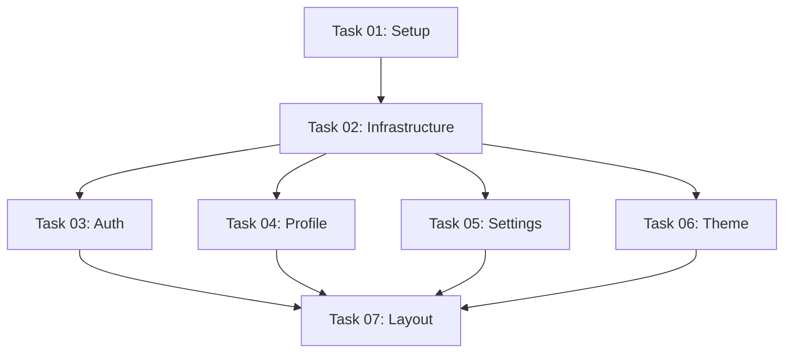

# Task Plan Critique v2

**Project:** videoshorts-stage-01-core-auth
**Date:** 2025-11-28
**Reviewer:** task-planner-critic
**Previous Version:** critique_v1.md (rejected for missing Visual Verification Steps)

---

## Validation Summary

| Category | Status | Details |
|----------|--------|---------|
| Task Sizes | PASS | All tasks within limits |
| Dependencies | PASS | Correct and clear |
| Frontend Coverage | PASS | Task 07 handles navigation |
| Translations | PASS | 5 languages (pl, en, de, es, ru) |
| Acceptance Criteria | PASS | All tasks have testable criteria |
| Visual Verification Steps | PASS | All tasks now have proper verification |

---

## Task Size Validation

| Task | Files | Tokens | Verdict |
|------|-------|--------|---------|
| 01 | 8 | ~8k | PASS (Simple) |
| 02 | 12 | ~12k | PASS (Medium) |
| 03 | 18 | ~18k | PASS (Medium) |
| 04 | 14 | ~14k | PASS (Medium) |
| 05 | 10 | ~10k | PASS (Simple) |
| 06 | 9 | ~9k | PASS (Simple) |
| 07 | 16 | ~16k | PASS (Medium) |

**Total:** 87 files, ~97k tokens
**All tasks under 20 files/25k tokens limit**

---

## Dependency Validation

**Dependencies are correct:**
- Task 01 (Setup) blocks all others
- Task 02 (Infrastructure) blocks features (03-07)
- Tasks 03-06 can run in parallel
- Task 07 (Layout) integrates everything

---

## Coverage Validation

### Database Coverage
- Task 02 creates Prisma schema with 5 models
- Migrations handled in Task 02

### Backend Coverage
- Task 02: Core infrastructure (auth, db, storage, email)
- Task 03: Authentication API routes
- Task 04: Profile API routes
- Task 05: Settings API routes
- Task 06: Theme/preferences logic

### Frontend Coverage
- Task 03: Auth pages (login, signup, verify, forgot-password, reset-password)
- Task 04: Profile edit page
- Task 05: Settings page (password change, account deletion)
- Task 06: Theme toggle, language switcher
- Task 07: Sidebar, Header, Footer, Mobile drawer

### Navigation/Integration
- Task 07 handles full layout integration
- Includes routing and navigation components

### Translation Coverage
All tasks include translations for 5 languages:
- Polski (pl)
- English (en)
- Deutsch (de)
- Español (es)
- Русский (ru)

**Translation files:** 30 total (auth.json, common.json, profile.json, settings.json, preferences.json, sidebar.json)

---

## Visual Verification Validation

### Task 01: Project Setup
**Visual Verification Steps:** PASS
- Prerequisites defined (Node.js 18+, npm/yarn, terminal)
- Steps table with 7 verification steps
- Commands: `npm run dev`, `npm run build`, `npx tsc --noEmit`
- Expected results clearly defined
- NO UI screenshots needed (setup task)

### Task 02: Core Infrastructure
**Visual Verification Steps:** PASS
- Prerequisites defined (Task 01 complete, PostgreSQL, .env.local)
- Steps table with 7 verification steps
- Commands: `npx prisma validate`, `npx prisma migrate dev`, `npx prisma studio`
- Database verification checklist included
- NO UI screenshots needed (backend task)

**Note:** Tasks 01 and 02 are infrastructure tasks without UI components. They use command-line verification instead of browser-based verification, which is appropriate.

---

## Acceptance Criteria Validation

### Task 01
- Next.js 14+ project initialized
- TypeScript 5.3+ configured
- Tailwind CSS v3+ configured
- All dependencies installed
- Build passes without errors

**Verdict:** TESTABLE

### Task 02
- Prisma schema with 5 models
- Database migrations created
- NextAuth v5 configured with 3 providers
- R2 client functional
- Resend client functional
- Middleware protects `/panel/*` routes

**Verdict:** TESTABLE

---

## Issues Found

**NONE**

---

## Verdict

**OK**

All previous issues have been resolved:
- Task 01 now has proper Visual Verification Steps (command-line based)
- Task 02 now has proper Visual Verification Steps (Prisma Studio + command-line)
- All tasks are properly sized (under 20 files/25k tokens)
- Dependencies are correct
- Translation coverage is complete (5 languages)
- Acceptance criteria are testable

The task plan is ready for implementation.
