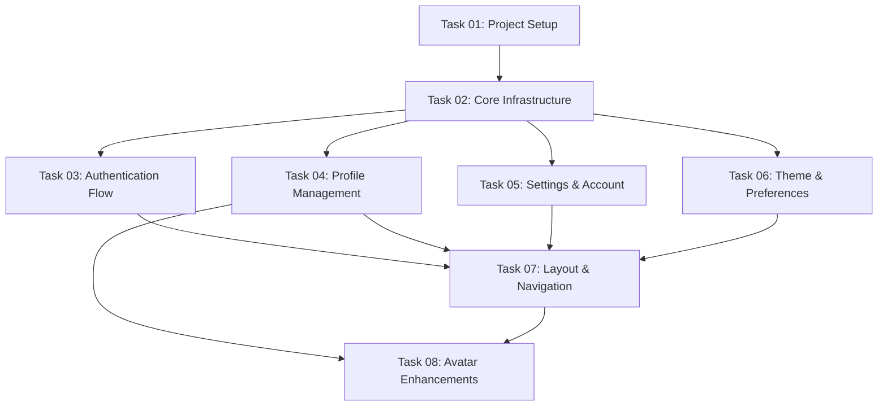

# Tasks Overview: Core + Auth (Stage 1)

**Project:** videoshorts-stage-01-core-auth
**Type:** GREENFIELD
**Total Tasks:** 8

---

## Task Execution Order

---

## Task Summary

| Task | Name | Priority | Dependencies | Complexity | Status |
|------|------|----------|--------------|------------|--------|
| 01 | Project Setup | HIGH | None | Simple (8 files, ~8k tokens) | completed |
| 02 | Core Infrastructure | HIGH | task-01 | Medium (12 files, ~12k tokens) | completed |
| 03 | Authentication Flow | HIGH | task-02 | Medium (18 files, ~18k tokens) | completed |
| 04 | Profile Management | MEDIUM | task-02 | Medium (14 files, ~14k tokens) | completed |
| 05 | Settings & Account | MEDIUM | task-02 | Simple (10 files, ~10k tokens) | completed |
| 06 | Theme & Preferences | MEDIUM | task-02 | Simple (9 files, ~9k tokens) | completed |
| 07 | Layout & Navigation | HIGH | task-03, task-04, task-05, task-06 | Medium (16 files, ~16k tokens) | completed |
| 08 | Avatar Enhancements | MEDIUM | task-04, task-07 | Medium (11 files, ~11k tokens) | pending |

**Total Files:** ~98 files
**Total Estimated Tokens:** ~108k tokens

---

## Task Breakdown by Category

### Foundation (Tasks 01-02)
- **Task 01:** Next.js init, dependencies, config files
- **Task 02:** Prisma schema, NextAuth, R2, Resend clients

### Core Features (Tasks 03-06)
- **Task 03:** Login, Signup, Email verification, Password reset
- **Task 04:** Profile edit, Avatar upload
- **Task 05:** Password change, Account deletion
- **Task 06:** Theme toggle, Language switcher

### Integration (Task 07)
- **Task 07:** Sidebar, Header, Footer, Mobile drawer, Translations (5 languages)

### Enhancements (Task 08)
- **Task 08:** Avatar cropping, deletion, R2 cleanup

---

## Complexity Distribution

| Complexity | Count | Tasks |
|------------|-------|-------|
| Simple | 3 | 01, 05, 06 |
| Medium | 5 | 02, 03, 04, 07, 08 |
| Complex | 0 | - |

---

## Critical Path

**Blocking Tasks:**
1. Task 01 (Setup) → Blocks ALL
2. Task 02 (Infrastructure) → Blocks 03-07
3. Task 07 (Layout) → Final integration

**Parallel Execution:**
- Tasks 03, 04, 05, 06 can be executed in parallel after Task 02 completes

---

## Translation Coverage

**All tasks include translation files for 5 languages:**
- Polski (pl)
- English (en)
- Deutsch (de)
- Español (es)
- Русский (ru)

**Translation files per task:**
- Task 03: auth.json, common.json (10 files)
- Task 04: profile.json (5 files)
- Task 05: settings.json (5 files)
- Task 06: preferences.json (5 files)
- Task 07: sidebar.json (5 files)
- Task 08: profile.json updates (5 files)

**Total translation files:** 35 files

---

## Success Criteria

**For each task:**
- [ ] All files created/modified as specified
- [ ] `npm run build` passes without errors
- [ ] No TypeScript errors
- [ ] No ESLint errors
- [ ] All imports resolve correctly

**For final deployment:**
- [ ] All 8 tasks completed
- [ ] Full authentication flow works
- [ ] Profile management works (with avatar cropping & deletion)
- [ ] Theme switching works
- [ ] All 5 languages load correctly
- [ ] Database migrations applied
- [ ] Environment variables configured
- [ ] R2 storage cleanup works (no orphaned files)

---

## Notes

1. **GREENFIELD project** - All code created from scratch
2. **Complexity estimates** based on: 1 file ≈ 1k tokens
3. **Tasks 03-06 are independent** - can be worked in parallel
4. **Task 07 integrates everything** - must be last
5. **All visual verification requires** Chrome DevTools MCP with localhost:3000
